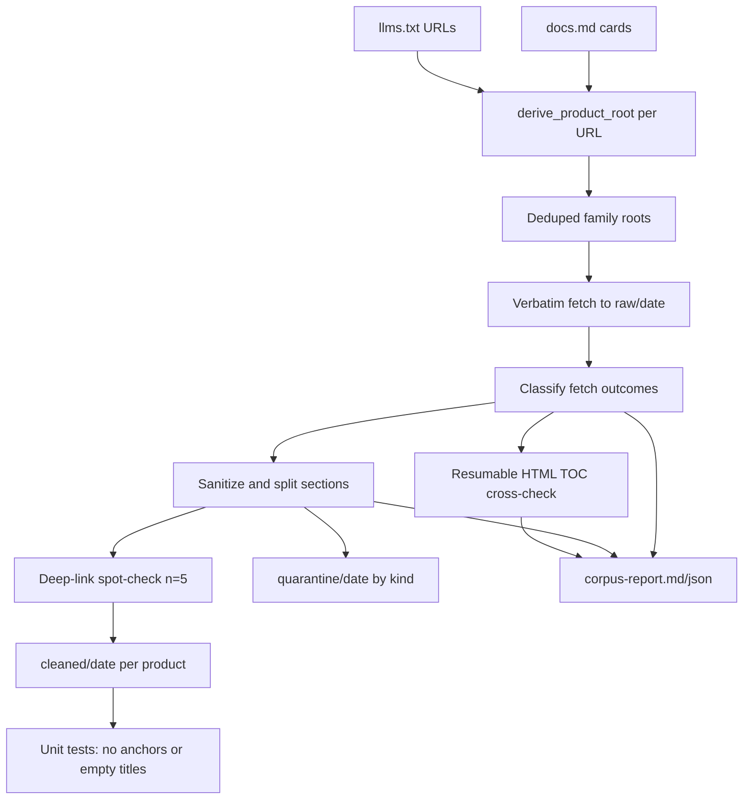

# Plan: Developer Site Markdown Corpus Pipeline

**ID:** 2026-08-08-001
**Status:** VETTED (2026-08-08) — approve-with-changes applied
**Scope:** llms.txt-first fetch → sanitize → TOC proof for developer.cybersource.com family roots

## Target and baseline

- **Site:** [developer.cybersource.com](https://developer.cybersource.com) (+ linked [developer.visaacceptance.com](https://developer.visaacceptance.com) URLs in llms.txt)
- **Home repo:** [`/home/badari/workspace/poornima/visa-relay-bench`](/home/badari/workspace/poornima/visa-relay-bench) — reuse existing engine modules rather than starting fresh
- **Live index sizes (probed today):**
  - llms.txt: **475** unique `.md` URLs → **212** deduped family roots
  - docs.md: **16** product cards → **15** derived roots (ACH is PDF-only)
  - docs.md adds **0** roots llms.txt missed (llms is a strict **superset** of docs.md products — verified, not assumed)
  - With HTTP probe + guide-dir fallback: **171/212** roots fetch as markdown; **41** currently labeled unfetchable — **must be split before the run** (see Unfetchable taxonomy)

## Architecture



## Phase 1 — Discovery (FETCH steps 1–2)

Add [`content_bench/content_engine/corpus_discovery.py`](/home/badari/workspace/poornima/visa-relay-bench/content_bench/content_engine/corpus_discovery.py):

1. **Fetch indexes** with stdlib `urllib` (same as [`toc_fetch.http_get`](/home/badari/workspace/poornima/visa-relay-bench/content_bench/content_engine/toc_fetch.py)):
   - `https://developer.cybersource.com/llms.txt`
   - `https://developer.cybersource.com/docs.md`

2. **Extract URLs** from llms.txt:
   - All `*.md` on cybersource + visaacceptance domains
   - All `*.pdf` — record immediately as `unfetchable: pdf` (never skip silently)

3. **Derive family root** for each llms URL using existing logic in [`product_roots.py`](/home/badari/workspace/poornima/visa-relay-bench/content_bench/content_engine/product_roots.py):
   - Primary: `derive_family_repeat_root` (e.g. `…/boarding/…/boarding-intro-overview.md` → `…/boarding.md`)
   - Fallback: `derive_guide_dir_root` when family name does not repeat (eCheck, payouts, transit, etc.) — **this is where wrong URLs like `…/rest.md` come from**
   - Already-a-root paths pass through unchanged

4. **Dedupe** derived roots → **corpus denominator set** with provenance:
   ```json
   { "root": "/docs/cybs/en-us/boarding/developer/all/rest/boarding.md",
     "source": "llms.txt", "sample_urls": 27, "derivation": "family_repeat" }
   ```
   `derivation` is one of: `family_repeat` | `guide_dir` | `passthrough_root` | `docs_md_card`.

5. **docs.md cross-check:** derive roots from [`parse_docs_md_products`](/home/badari/workspace/poornima/visa-relay-bench/content_bench/content_engine/product_roots.py); union any roots not already in llms set; report `docs_only_roots` (expected: ACH PDF + any future hub-only products).

6. **Derivation accuracy (required report, not optional):**
   | Metric | Definition |
   |---|---|
   | Roots derived by `family_repeat` | count + share of denominator |
   | Roots derived by `guide_dir` | count + share |
   | Fetch success rate by rule | `ok / derived` for each rule |
   | Failures by rule × reason | e.g. guide_dir × http_404 |

   If most of the 41 failures come from `guide_dir`, the **fallback is wrong**, not the site incomplete — fix derivation before treating failures as product gaps. (Trap two: soft gap ≠ missing docs.)

## Phase 2 — Verbatim fetch (FETCH step 3)

Add CLI [`pipelines/build_developer_corpus.py`](/home/badari/workspace/poornima/visa-relay-bench/pipelines/build_developer_corpus.py) with `--stamp-date YYYY-MM-DD`:

- Output: `raw/<date>/` (e.g. `raw/2026-08-07/`)
- Reuse [`fetch_product_root`](/home/badari/workspace/poornima/visa-relay-bench/content_bench/content_engine/product_roots.py) — plain HTTP, byte-for-byte, trailing newline only
- **No** WebFetch, no HTML fallback for roots (record failure instead; HTML fallback remains available only for per-topic TOC probes inside cross-check)
- Rate-limit ~80ms between requests (match existing pipelines)
- **Unfetchable roots stay in the denominator** — never drop

### Unfetchable taxonomy (split before the run — not a follow-up)

One bucket of “41 unfetchable” is trap two. Split at classify time:

| Reason code | Meaning | Whose bug |
|---|---|---|
| `pdf` | Source is PDF-only | Site / content form |
| `http_404` on **constructed** root URL | Derivation produced a non-existent path (e.g. `…/rest.md`) | **Ours until proven otherwise** → `derivation_error` |
| `http_500` on a URL that is a real site path | Server error on an existing resource (e.g. merchant-boarding.md) | **Theirs** → `site_defect` |
| `empty_200` | HTTP 200 with empty/near-empty body | **Distinct diagnosis** — URL may be valid but content served another way; possibly recoverable; **not** the same as 404 |
| `hub_page` | Thin hub / index (e.g. `/accept-payments.md`) not a mega-guide | Classification; keep in denominator with reason |

Manifest shape:

```json
{
  "root": "/docs/.../rest.md",
  "http_status": 404,
  "bytes": 0,
  "fetch_status": "unfetchable",
  "bucket": "derivation_error",
  "reason": "http_404",
  "derivation": "guide_dir",
  "sample_source_url": "..."
}
```

Report rollups: `derivation_error` count vs `site_defect` count vs `empty_200` vs `pdf` vs `hub_page`. A 404 on a URL we constructed is ours until proven otherwise. A 500 on a URL that exists is theirs.

## Phase 3 — TOC completeness proof (FETCH steps 4–5)

For each **successfully fetched** root, reuse [`cross_check_toc`](/home/badari/workspace/poornima/visa-relay-bench/content_bench/content_engine/product_roots.py):

1. Fetch family HTML page (`root.md` → `root.html`)
2. Extract topic paths via [`extract_toc_topics`](/home/badari/workspace/poornima/visa-relay-bench/content_bench/content_engine/toc_fetch.py)
3. For each topic, prefer **local guides cache** if present; else fetch `.md` verbatim
4. Test coverage with [`toc_page_covered_by_root`](/home/badari/workspace/poornima/visa-relay-bench/content_bench/content_engine/product_roots.py) (anchor overlap + distinctive prose)
5. Report per product: `{ toc_topics, toc_covered, toc_missed[] }` — every number over its denominator with source file path

### Runtime (honest)

15–25 minutes covers probes + root fetches only. TOC cross-check fetches every topic for every product: 16 products already had **1,423** topics; **171** products will be several thousand requests at ~80ms plus latency → **plan for hours**. Requirements:

- `--resume` / checkpoint file so a failure at hour two does not restart at zero
- Prefer local `data/products/*/guides` cache before network
- `--only product…` for incremental runs still supported

**Prior art:** existing [`artifacts/content_engine/product_roots/product-roots-report.md`](/home/badari/workspace/poornima/visa-relay-bench/artifacts/content_engine/product_roots/product-roots-report.md) shows 16/17 docs.md products at 1421/1423 TOC coverage; full llms corpus will surface additional families and classified unfetchables.

## Phase 3b — Deep-link spot-check (before bulk sanitize)

Deep links are built as `root.html` + `#` + markdown `{#anchor}`. Markdown anchor ids do **not** always match HTML fragment ids on the rendered page. Thousands of deep links that scroll nowhere would undo the benefit of lifting anchors.

**Before generating the full cleaned corpus**, spot-check **five** deep links across **different products** (mix family_repeat and guide_dir roots). For each: HTTP GET the HTML URL, confirm the fragment id exists in the page (or that the browser-equivalent anchor is present). If fewer than 5/5 resolve, **stop and fix** anchor→fragment mapping before bulk emit.

Record results in `artifacts/content_engine/corpus_build/deep-link-spotcheck.json`.

## Phase 4 — Sanitize and split (SANITIZE steps 6–10)

Add [`content_bench/content_engine/corpus_sanitize.py`](/home/badari/workspace/poornima/visa-relay-bench/content_bench/content_engine/corpus_sanitize.py) — document-level sanitizer built on [`source_noise.py`](/home/badari/workspace/poornima/visa-relay-bench/content_bench/content_engine/source_noise.py) + [`split_root_sections`](/home/badari/workspace/poornima/visa-relay-bench/content_bench/content_engine/product_roots.py):

### Per-root processing

1. **Split** by `{#anchor}` headings (ATX + DITA underline) → sections with byte ranges
2. **For each section**, produce a cleaned record:

```json
{
  "anchor": "boarding-intro-overview",
  "title": "Introduction to the Boarding Registration Service",
  "parent_product": "boarding",
  "root_path": "/docs/cybs/en-us/boarding/developer/all/rest/boarding.md",
  "deep_link": "https://developer.cybersource.com/docs/cybs/en-us/boarding/developer/all/rest/boarding.html#boarding-intro-overview",
  "byte_start": 1204,
  "byte_end": 3988,
  "anchors_lifted": ["boarding-intro-overview"],
  "image_refs_removed": ["/content/dam/.../icon.png"],
  "body": "...clean markdown, zero {#...}..."
}
```

3. **Lift, don't delete** (step 6):
   - Move all `{#id}` from body → `anchors_lifted` metadata
   - Build `deep_link` via existing [`deep_link_for`](/home/badari/workspace/poornima/visa-relay-bench/content_bench/content_engine/source_noise.py)

4. **Strip noise** (step 7):
   - Duplicate anchor-only lines (`^\s*\{#[^}]+\}\s*$`)
   - Empty link titles: `](url "")` → `](url)` (regex from `source_noise`)
   - Broken image refs: remove `` from body, record path in `image_refs_removed`

5. **Code blocks** (step 8):
   - Scan **raw section bytes** (not the cleaned body) for fenced blocks — subtle; cleaning can disturb fences
   - Preserve **byte-exact** fence content + language tag
   - Attach `nearest_anchor` = closest preceding section anchor
   - Write sidecar: `cleaned/<date>/<product>/code_blocks.json`

6. **Section quarantine** (step 9) — kinds named explicitly in
   [`data/content_engine/corpus_section_quarantine_policy.json`](/home/badari/workspace/poornima/visa-relay-bench/data/content_engine/corpus_section_quarantine_policy.json)
   (these are exactly what produced the broken Auth Setup page when left in):

   | Kind | What it catches |
   |---|---|
   | `revision_history` | Revision histories / `doc-revisions` / “Recent Revisions” |
   | `about_guide_boilerplate` | “About this guide”, audience, conventions blocks |
   | `support_center` | Support Center sections / support-link dumps |
   | `navigation_list` | Pure navigation lists (high link density, no constraint signals — reuse [`triage.link_density`](/home/badari/workspace/poornima/visa-relay-bench/content_bench/content_engine/triage.py) + `has_constraint_signals`) |

   Quarantined sections keep full metadata + reason; excluded from `cleaned/` body files but **never discarded**.

### Output layout

```
raw/2026-08-07/
  en-us_boarding_developer_all_rest_boarding.md.md
  manifest-ok.json
  manifest-unfetchable.json    # split by bucket/reason/derivation
cleaned/2026-08-07/
  boarding/
    sections/*.md              # one file per non-quarantined section
    manifest.json              # per-product (not one monolithic JSON)
    code_blocks.json
quarantine/2026-08-07/
  boarding/
    *.json                     # by quarantine kind
artifacts/content_engine/corpus_build/
  corpus-report.md
  corpus-report.json
  discovery.json               # llms vs docs + derivation accuracy
  toc-completeness.json        # resumable checkpoints alongside
  deep-link-spotcheck.json
```

**Scale:** 171 mega-guides × hundreds of sections → per-product manifests only; never one giant JSON.

## Phase 5 — Tests (TEST)

Add [`tests/test_corpus_sanitize.py`](/home/badari/workspace/poornima/visa-relay-bench/tests/test_corpus_sanitize.py) and [`tests/test_corpus_discovery.py`](/home/badari/workspace/poornima/visa-relay-bench/tests/test_corpus_discovery.py):

- **Hard gates on every cleaned section file:**
  - No `\{#[^}]+\}` in body
  - No `\]\([^)]+\s+""\)` empty link titles
- **Anchor lift:** input with `{#foo}` → metadata contains `anchors_lifted: ["foo"]` + valid `deep_link`
- **Code block fidelity:** fence bytes unchanged after sanitize pass (scanned from raw)
- **Derivation fixtures:** boarding/payments/tms family-repeat + echeck guide-dir + PDF skip
- **Unfetchable buckets:** 404 constructed → `derivation_error`; 500 real path → `site_defect`; empty body → `empty_200`
- **Integration smoke:** run sanitizer on fixture roots under [`data/products/boarding/guides/`](/home/badari/workspace/poornima/visa-relay-bench/data/products/boarding/guides)

Wire into existing `python3 -m unittest discover -s tests`.

## Phase 6 — Report (REPORT)

Generate [`artifacts/content_engine/corpus_build/corpus-report.md`](/home/badari/workspace/poornima/visa-relay-bench/artifacts/content_engine/corpus_build/corpus-report.md) with per-product table:

| Column | Source |
|---|---|
| Root fetched (y/n) | `raw/<date>/manifest-ok` |
| Bytes | fetch record |
| Derivation rule | discovery.json |
| Sections split | sanitize manifest |
| TOC topics / covered / missed | toc-completeness.json |
| Quarantined by kind | quarantine manifests |
| Code blocks preserved | code_blocks.json count |

Plus rollups with denominators (every number names its source file):
- `roots_fetched / roots_discovered` (source: `discovery.json`)
- Fetch success rate by `derivation` rule
- Unfetchable by bucket: `derivation_error` | `site_defect` | `empty_200` | `pdf` | `hub_page`
- `sections_clean / sections_total`
- `toc_covered / toc_topics` per product and global
- `docs_only_roots` list
- Deep-link spot-check pass/fail

## Files to create/modify

| Action | File |
|---|---|
| **Create** | `content_bench/content_engine/corpus_discovery.py` |
| **Create** | `content_bench/content_engine/corpus_sanitize.py` |
| **Create** | `pipelines/build_developer_corpus.py` |
| **Create** | `tests/test_corpus_discovery.py`, `tests/test_corpus_sanitize.py` |
| **Create** | `data/content_engine/corpus_section_quarantine_policy.json` (kinds listed above) |
| **Extend** | `product_roots.py` — export helpers if needed to avoid duplication |
| **Update** | [`CONTEXT.md`](/home/badari/workspace/poornima/visa-relay-bench/CONTEXT.md) — llms.txt-first discovery with docs.md cross-check; product root = denominator; TOC = cross-check only |
| **Sync** | Port new engine modules to public [`content-bench`](/home/badari/workspace/poornima/content-bench) per ENGINE_UPSTREAM rule |

## Execution command (after implementation)

```bash
cd /home/badari/workspace/poornima/visa-relay-bench
git checkout -b cursor/developer-corpus-pipeline-0af3
python3 pipelines/build_developer_corpus.py --stamp-date 2026-08-07
# TOC is resumable:
python3 pipelines/build_developer_corpus.py --stamp-date 2026-08-07 --resume --phase toc
python3 -m unittest discover -s tests -k corpus
```

## Risks and mitigations

- **Unfetchable split (was “41 unfetchable”):** classify as `derivation_error` vs `site_defect` vs `empty_200` vs `pdf` vs `hub_page` **before** treating numbers as site findings. Trap two.
- **Fallback derivation accuracy:** report success rate for `guide_dir` separately; if it dominates failures, fix the rule.
- **Runtime:** root fetch tens of minutes; full TOC cross-check **hours**. Resumable checkpoints + local guides cache required.
- **Deep links:** spot-check 5 across products before bulk emit.
- **Scale:** per-product manifests only.
- **ACH PDF:** `unfetchable` / `pdf`; stays in denominator; no markdown corpus entry.

## Out of scope (this pass)

- Claim extraction / ingest into `normalized/` (downstream of cleaned corpus)
- Serving cleaned docs via portal/MCP (`content/` PR flow unchanged)
- Fixing upstream CyberSource llms.txt omissions (report only, per existing gap-report pattern)
