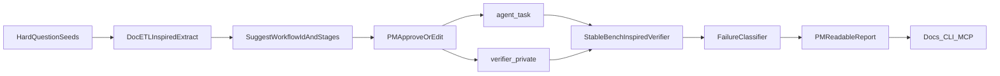

# What We’ve Built: Relay Bench V0

## One-sentence answer

A **local, credential-free prototype** that turns messy forum/docs/support confusion about CyberSource payment workflows into a **workflow contract** an agent can attempt, a verifier can grade, and a PM can use to decide what to improve next (docs, VAP CLI, MCP).

## Why it exists

Before this, a stuck developer had to stitch together:

- forum answers
- docs pages
- SDK quirks
- stage/order rules
- AI answers that may skip steps

Relay Bench makes that into a repeatable loop:



## What it is / is not

| It is | It is not |
|-------|-----------|
| DocETL-**inspired** discovery (local heuristics) | Real [`ucbepic/docetl`](https://github.com/ucbepic/docetl) |
| Stable Bench-**inspired** verifier (fixture checks) | Real [`tempoxyz/tempo-evals`](https://github.com/tempoxyz/tempo-evals) / Harbor / Docker |
| Credential-free local proof | Live CyberSource sandbox |
| Product-shape prototype for Relay | Production Relay or VAP CLI |

## The three workflows

From 20 frozen seeds in [`data/hard_questions.seed.jsonl`](../data/hard_questions.seed.jsonl), PM approvals reduce to **3 contracts**:

1. **`flex-token-lifecycle`** — Flex transient token vs permanent TMS instrument
2. **`http-signature-debug`** — HTTP Signature field names, host, signed headers
3. **`microform-payer-auth-state-machine`** — Microform tokenize vs full Payer Auth/3DS state machine

That reduce step is the DocETL-inspired value: **many confused inputs → one richer workflow contract**.

## Core engineering idea: hidden-truth separation

Two artifacts, never mixed:

- **`agent_task`** ([`artifacts/task_packs/*.agent_task.json`](../artifacts/task_packs/)) — instruction, stages, public facts, constraints. Safe to show an agent.
- **`verifier_private`** ([`artifacts/task_packs/*.verifier_private.json`](../artifacts/task_packs/)) — oracle, bad-answer fixture, hidden checks, scoring rubric. Never agent-facing.

The verifier must catch the **full expected failure set** on the known-bad answer (not “any one failure”).

## Code map

| Piece | Role |
|-------|------|
| [`relay_bench/discovery.py`](../relay_bench/discovery.py) | Extract goal/symptoms/entities; suggest workflow |
| [`relay_bench/pm_gate.py`](../relay_bench/pm_gate.py) | PM approve/edit; reduce by `workflow_id` |
| [`relay_bench/task_pack.py`](../relay_bench/task_pack.py) | Export `agent_task` + `verifier_private` |
| [`relay_bench/verifiers.py`](../relay_bench/verifiers.py) | Oracle pass + bad-answer full-set catch |
| [`relay_bench/routing.py`](../relay_bench/routing.py) | Failure → docs/SDK/VAP CLI/MCP actions |
| [`relay_bench/reporting.py`](../relay_bench/reporting.py) | Five-question PM report |
| [`pipelines/run_bench_v0.py`](../pipelines/run_bench_v0.py) | End-to-end staged runner |

## What a successful run proves (Microform example)

For `microform-payer-auth-state-machine`, the system can say:

1. Developers confuse Microform tokenize with completed 3DS
2. Correct stages include enrollment → challenge/frictionless → validate → authorize
3. Bad answer skips those stages
4. Verifier fails `enrollment_present`, `dual_path_handling`, `auth_refs_on_payment`, `state_machine_complete`
5. Next product surface: clearer docs + VAP CLI workflow verifier

## Where to read first

1. [`reports/pm_workbook.md`](pm_workbook.md) — why this matters
2. [`reports/demo_microform_payer_auth_state_machine.md`](demo_microform_payer_auth_state_machine.md) — the story
3. [`artifacts/reports/microform-payer-auth-state-machine.report.md`](../artifacts/reports/microform-payer-auth-state-machine.report.md) — generated proof
4. [`HANDOFF.md`](../HANDOFF.md) — acceptance criteria

## How to run it

```bash
python3 -m unittest discover -s tests
python3 pipelines/synthesize_candidates.py
python3 pipelines/run_bench_v0.py --workflow microform-payer-auth-state-machine
```

## Bottom line for PM / product

V0 proves the **shape** of a measurable DX loop: confusion → contract → grade → product action.
V1 decides whether to keep this lightweight local implementation or plug in real DocETL + Tempo/Harbor for production-scale discovery and isolated agent evals.
